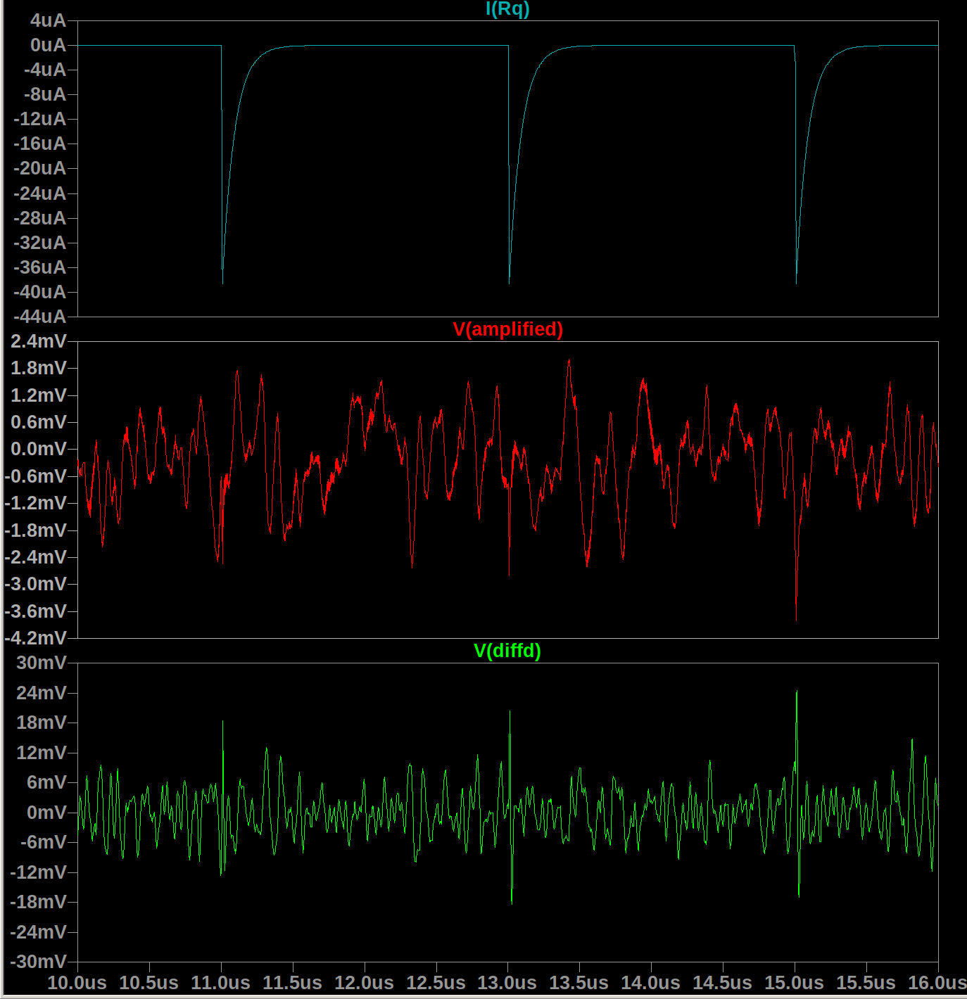

# SiPM readout with delay line + op amp difference circuit
This circuit is a "proof of concept" of SiPM readout using a transimpedance amplifier and 10ns delay line.

## SiPM pulse model
The SiPM pulse is modeled as a current source with some passives around it,
    following [Corsi+2009](https://iopscience.iop.org/article/10.1088/1748-0221/4/03/P03004).
The quench resistor was measured and the capacitance was estimated from the data sheet,
    along with proportionalities in the Corsi paper.

## Noise
Noise is added as a current source in parallel with the SiPM output.
The noise is computed from a set of [SiPM data files](https://drive.google.com/file/d/1B_HgeoaYKLUvYqs2lcNH6SjFHtsubq7R/view?usp=sharing)
taken using a [Cremat CR-112](https://www.cremat.com/CR-111-R2.pdf) charge-sensitive preamplifier (CSP).
The noise is almost certainly low-pass filtered by the CSP because it is integrating in nature.
Nonetheless, for a trapezoidal current pulse with:
- rise, fall time = 3ns
- on time = 4ns
- amplitude = 500 uA
- i.e. total charge = 5 pC ~ 10 optical photons ~ 1 keV,
we are still able to detect pulses.
They are actually buried completely in the noise and only become clear after the delay line difference circuit,
as we can see in the second photo below.
### Script to generate the SiPM noise file
Download the SiPM data files from the link above.
Then, after `pip install`ing the Python in this repo, run:
```py
sipm-noise -d /path/to/noise/files --min " -200e-6" --max " 200e-6" -t 1e-3 -s 1e-9
```
Then you can run the LTspice simulation with the current source in parallel.

## Analog processing
The current pulse is immediately transformed into a voltage pulse by a fast (4GHz gain bandwidth)
transimpedance amplifier implemented with an
[AD6268-10](https://www.analog.com/media/en/technical-documentation/data-sheets/626810f.pdf) op amp.

The SiPM pulse is delayed by 10ns through an ideal transmission line of length ~1.5 meters.
Then the difference between the delayed- and non-delayed pulses is taken.
Even with the amplified pulse buried in the (simulated) white noise,
the SiPM pulse is recovered:


When using a more realistic noise simulation
(PSD of the noise taken from real data,)
we still see that pulses may be recovered in the "differenced" signal
as opposed to the straight-up amplified one.


More work needs to be done to incorporate a summing amplifier for multiple SiPM to be read out simultaneously.
But this is a good start.
