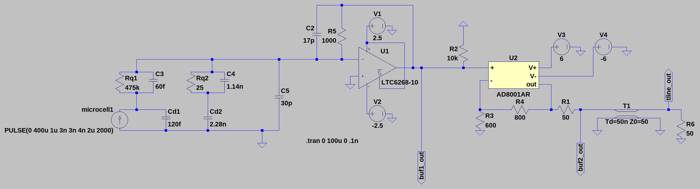
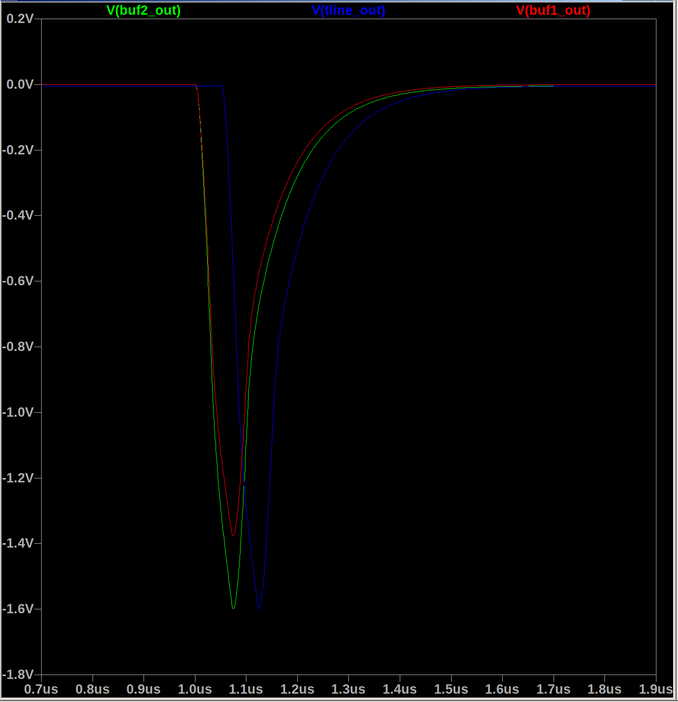

# Transimpedance amplifier coupled to 800 MHz line driver
## Background
After building the SiPM transimpedance amplifier in-lab we discovered a few things:
- It does not like driving long cables
- It is very sensitive to the compensation capacitor Cf in the feedback loop
- We probably need more gain than we had initially thought
- Connecting the TIA to the fast output and then running it through RF combiners leads to lots of strange oscillations

In light of these facts,
    I'm hoping to modify a couple pieces of the TIA design so that we can run it through a delay line and have success
    by differencing it with very nice RF transformers.

## Simulation contents

The simulation has the same SiPM model as used in a separate spice simulation,
    again following [Corsi+2009](https://iopscience.iop.org/article/10.1088/1748-0221/4/03/P03004).
The current source has been adjusted to deliver a 100ns rise time pulse
    (equivalent to the slow SiPM output)
    with the same charge as used previously.
We put the SiPM current pulse through a transimpedance amplifier with gain of 1000 ohm
    and compensation capacitor of 17 pF.
We need the compensation capacitor as per e.g. [Wikipedia](https://en.wikipedia.org/wiki/Transimpedance_amplifier#Bandwidth_and_stability).
The TIA is terminated with a 10k resistor and is fed into the noninverting input of the next amplification stage.

After the first stage of amplification,
    we put the voltage pulse through a noninverting "line driver" configuration,
    using an [AD8001](https://www.analog.com/media/en/technical-documentation/data-sheets/AD8001.pdf).
The AD8001 is an 800MHz gain-bandwidth amplifier designed for things like
    driving video lines for HD TVs.
In our case 800 MHz is plenty of bandwidth for the SiPM timescales we're interested in,
    namely ~10ns to ~100ns (100 MHz to 10 MHz).
The amplifier has a gain of 2 to compensate for the voltage-dividing nature
    of the ensuing transmission line and terminators.

After the line driver amplification stage,
    the pulse goes through a 50ns transmission line
    (equivalent to about 25 ft of BNC cable).
It is terminated at a 50 ohm resistor.

## Voltage pulse plots
Here are some plots of probe points which are labeled in the schematic above.
Stage 1 buffer is red, before transmission line is green, after is blue.
The voltage pulse amplitude and shape is preserved throughout the gain stages **in most cases, more on that later**.
The pulse is equivalent to an incident photon of energy ~150 keV
    assuming 60% photon collection from the crystal to the SiPM.
There is no noise added... yet

**The second amplification stage saturates well before it hits the power supply rail,**
    because of the 50-ohm termination (100 ohm load)
    placed on the output of the amplifier and the transmission line drawing lots of current.
**We will need to be careful when inserting this signal into the Bridgeport to clip the events to an appropriate level.**
Maybe one final amplifier stage before inserting the shaped pulses.

## Takeaway
The pulse amplitude is preserved and the first amplifier stage only has to drive the 
    input of the second amplifier,
    which is *designed* to drive transmission lines.
Going this route also isolates the output of the super high-bandwidth op amp
    from the rest of the circuitry.
This should hopefully help reduce ringing issues we were having
    when connecting the LTC6268-10 straight to the RF combiners.
